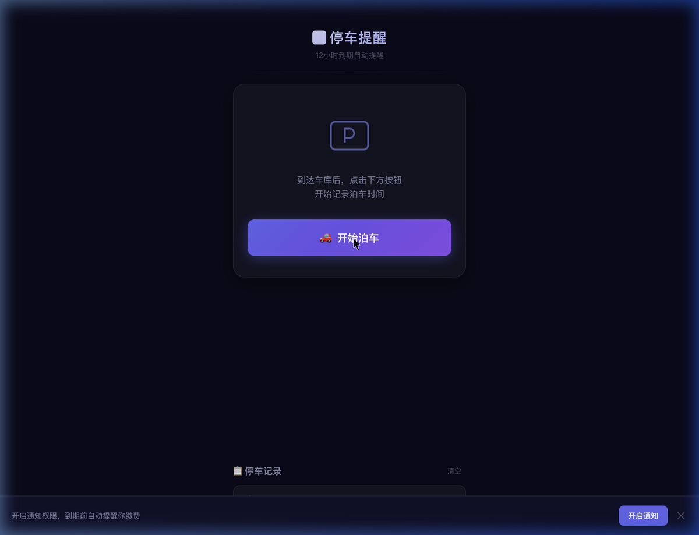
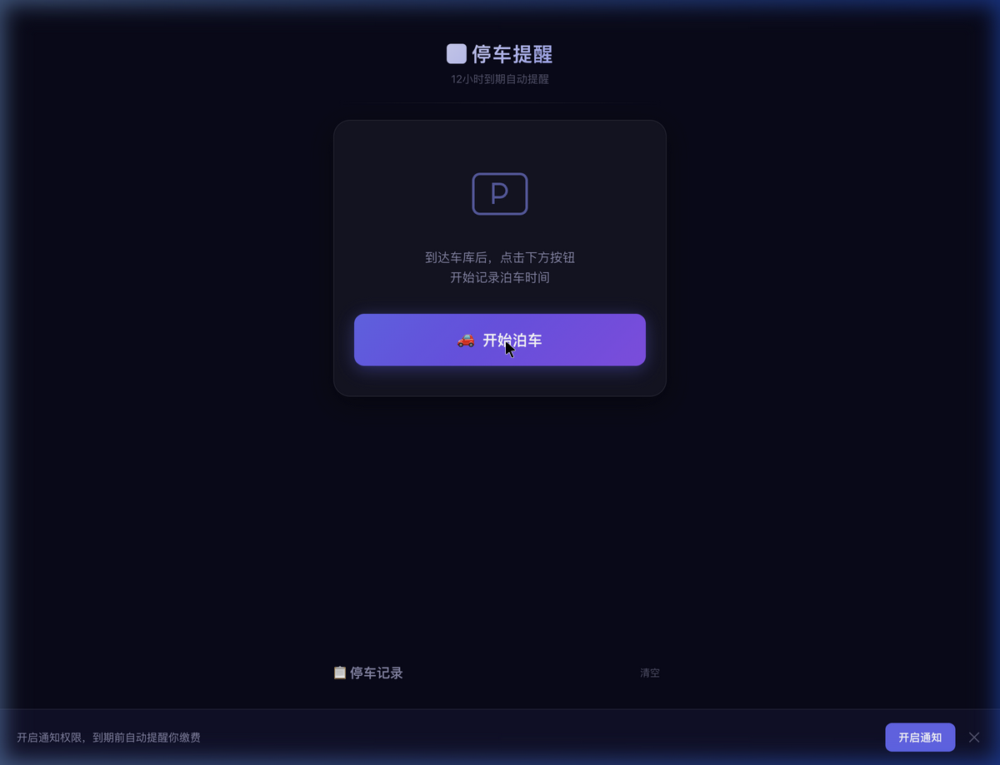

# 🅿️ 停车缴费提醒

一个轻量级 PWA 应用，帮你实时计算小区临停费用，在每次加费前自动提醒缴费离场，避免多花冤枉钱。

## 📖 背景

按照南京统一的小区临停计费规则：

| 条件 | 费用 |
|------|------|
| 停车 ≤ 1 小时 | 免费 |
| 1 小时 ~ 12 小时（一个计费周期） | ¥5 |
| 12 小时 ~ 24 小时 | ¥10 |
| 每增加 12 小时 | +¥5 |
| **同一 12h 周期内多次进出** | **只收一次 ¥5** |

> **12小时循环计次（核心红线）**：同一计费时段（即12小时）内，多次进出住宅物业管理区域的，只按一次计费（¥5）。超过12小时后，才重新开始下一次计次。
>
> 例：上次停车 2 小时缴费 ¥5，则 12 小时内再次进出均免费（已被上次缴费覆盖）。

晚上 9-10 点泊车入库，次日早上 9-10 点出发，经常恰好卡在 12 小时临界点多花 ¥5。其实提前缴费后有 15 分钟出库时间，完全来得及。这个小工具帮你在每次加费前 10 分钟自动提醒。

## ✨ 功能

- 🚗 **一键记录泊车时间** — 到达车库后点一下即可
- ⏱ **实时倒计时** — 显示距离下次加费的剩余时间
- 🔔 **加费前 10 分钟提醒** — 每个计费节点前自动通知
- 💰 **实时费用计算** — 显示当前累计停车费（免费/¥5/¥10/...）
- 🔄 **12h 计费周期追踪** — 自动识别是否在已缴费周期内，避免重复计费
- ✏️ **修改入库时间** — 忘记点击可事后手动调整
- 📋 **停车历史** — 自动记录每次停车时长和费用
- 🌙 **深色主题** — 夜间泊车、早起使用都护眼
- 📱 **PWA 支持** — 添加到手机主屏幕，像原生 App 一样使用
- 📶 **离线可用** — Service Worker 缓存，无网络也能正常使用

## 📸 截图

| 空闲状态 | 计时状态 |
|---------|---------|
|  |  |

## 🚀 快速开始

### 本地运行

```bash
# 克隆项目
git clone https://github.com/your-username/automatic-parking-reminder.git
cd automatic-parking-reminder

# 启动本地服务器（任选其一）
npx -y serve .
# 或
python3 -m http.server 3000
```

浏览器打开 `http://localhost:3000` 即可使用。

### 手机访问

1. 确保手机和电脑在同一局域网
2. 手机浏览器访问 `http://<电脑IP>:3000`
3. 添加到主屏幕：
   - **iOS**: Safari → 分享按钮 → 添加到主屏幕
   - **Android**: Chrome → 菜单 → 添加到主屏幕

### 部署到 GitHub Pages

```bash
git init
git add .
git commit -m "init: parking reminder PWA"
git remote add origin https://github.com/<your-username>/<repo-name>.git
git push -u origin main
```

在 GitHub 仓库 **Settings → Pages → Source** 选择 `main` 分支，即可获得永久在线地址。

## 📂 项目结构

```
automatic-parking-reminder/
├── index.html          # 主页面
├── style.css           # 深色主题样式（玻璃拟态 + 渐变动画）
├── app.js              # 核心业务逻辑（计时、通知、存储）
├── sw.js               # Service Worker（离线缓存 + 后台通知）
├── manifest.json       # PWA 配置（图标、主题色、启动方式）
├── icon-192.png        # 应用图标 192×192
├── icon-512.png        # 应用图标 512×512
├── screenshots/        # 截图
└── README.md
```

## 🔔 提醒策略

### 单次停车

```
泊车入库        1小时(免费结束)              12小时                 24小时
  │               │                         │                      │
  │  免费(¥0)     │       ¥5                │       ¥10            │  ¥15 ...
  │               │                         │                      │
  │          50min提醒📱                11h50m提醒📱          23h50m提醒📱
  │          "即将开始计费¥5"           "即将加到¥10"          "即将加到¥15"
```

### 12h 计费周期内再次停车

```
第一次停车(缴费¥5)                           12小时周期结束
  │──── 停2h ────│                              │
                 出库                            │
                   │                             │
            第二次停车（周期内）                   │
                   │─────────────────────────────│
                   显示: ✅ 已缴费覆盖            │
                   费用: 免费                     │
                   倒计时: 缴费周期剩余            │
```

- **免费期内**：显示"免费时间剩余"，50分钟时提醒即将计费
- **计费期内**：显示"距离下次加费还有"，每个12小时节点前10分钟提醒
- **已缴费周期内**：显示"缴费周期剩余"和绿色覆盖标识，不触发提醒
- **颜色变化**：`> 30分钟` 青紫渐变 → `< 30分钟` 黄橙渐变 → `< 10分钟` 红色脉冲

## ⚙️ 技术栈

- **纯前端**：HTML + CSS + JavaScript，零依赖
- **存储**：localStorage 持久化
- **通知**：Web Notification API
- **离线**：Service Worker + Cache API
- **PWA**：Web App Manifest

## 📝 注意事项

- iOS 设备需要 **iOS 16.4+** 且必须 **添加到主屏幕** 后才支持通知推送
- 浏览器后台通知效果因系统和浏览器而异，建议早上出门前打开 App 确认状态
- 所有数据存储在本地浏览器中，清除浏览器数据会丢失历史记录

## 📄 License

MIT
